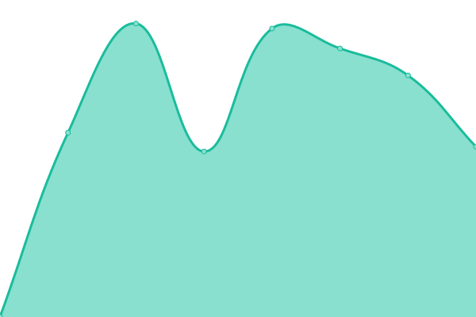

# [📈 Live Status](https://LeastAuthority.github.io/infrastructure-upptime): <!--live status--> **🟧 Partial outage**

This repository contains the open-source uptime monitor and status page for [Least Authority](https://leastauthority.com/), powered by [Upptime](https://github.com/upptime/upptime).

With [Upptime](https://upptime.js.org), you can get your own unlimited and free uptime monitor and status page, powered entirely by a GitHub repository. We use [Issues](https://github.com/LeastAuthority/infrastructure-upptime/issues) as incident reports, [Actions](https://github.com/LeastAuthority/infrastructure-upptime/actions) as uptime monitors, and [Pages](https://LeastAuthority.github.io/infrastructure-upptime) for the status page.

<!--start: status pages-->
<!-- This summary is generated by Upptime (https://github.com/upptime/upptime) -->
<!-- Do not edit this manually, your changes will be overwritten -->
<!-- prettier-ignore -->
| URL | Status | History | Response Time | Uptime |
| --- | ------ | ------- | ------------- | ------ |
|  Grafana - LA | 🟩 Up | [grafana-la.yml](https://github.com/LeastAuthority/infrastructure-upptime/commits/HEAD/history/grafana-la.yml) | 

 695ms
     
 | 

<a href="https://LeastAuthority.github.io/infrastructure-upptime/history/grafana-la">89.59%</a>
    

|  Grafana - MW | 🟩 Up | [grafana-mw.yml](https://github.com/LeastAuthority/infrastructure-upptime/commits/HEAD/history/grafana-mw.yml) | 

 696ms
     
 | 

<a href="https://LeastAuthority.github.io/infrastructure-upptime/history/grafana-mw">100.00%</a>
    

|  Grafana - HC | 🟥 Down | [grafana-hc.yml](https://github.com/LeastAuthority/infrastructure-upptime/commits/HEAD/history/grafana-hc.yml) | 

 482ms
     
 | 

<a href="https://LeastAuthority.github.io/infrastructure-upptime/history/grafana-hc">0.00%</a>
    

|  Grafana - PS | 🟩 Up | [grafana-ps.yml](https://github.com/LeastAuthority/infrastructure-upptime/commits/HEAD/history/grafana-ps.yml) | 

 691ms
     
 | 

<a href="https://LeastAuthority.github.io/infrastructure-upptime/history/grafana-ps">99.91%</a>
    

<!--end: status pages-->

[**Visit our status website →**](https://LeastAuthority.github.io/infrastructure-upptime)

## 📄 License

- Powered by: [Upptime](https://github.com/upptime/upptime)
- Code: [MIT](./LICENSE) © [Least Authority](https://leastauthority.com/)
- Data in the `./history` directory: [Open Database License](https://opendatacommons.org/licenses/odbl/1-0/)
