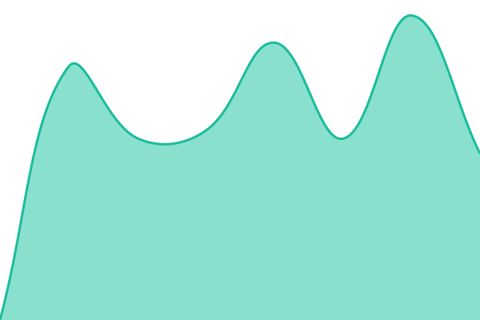
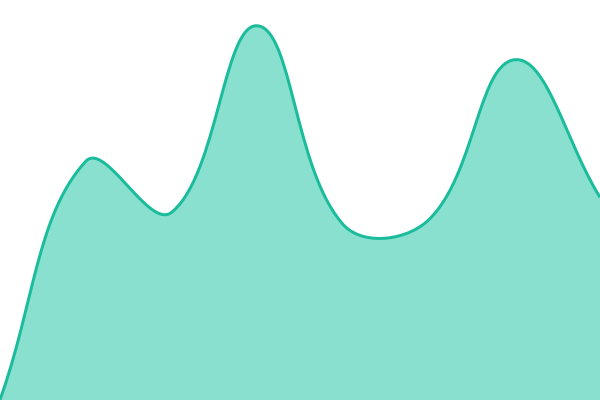

# [📈 Live Status](https://LeastAuthority.github.io/infrastructure-upptime): <!--live status--> **🟩 All systems operational**

This repository contains the open-source uptime monitor and status page for [Least Authority](https://leastauthority.com/), powered by [Upptime](https://github.com/upptime/upptime).

With [Upptime](https://upptime.js.org), you can get your own unlimited and free uptime monitor and status page, powered entirely by a GitHub repository. We use [Issues](https://github.com/LeastAuthority/infrastructure-upptime/issues) as incident reports, [Actions](https://github.com/LeastAuthority/infrastructure-upptime/actions) as uptime monitors, and [Pages](https://LeastAuthority.github.io/infrastructure-upptime) for the status page.

<!--start: status pages-->
<!-- This summary is generated by Upptime (https://github.com/upptime/upptime) -->
<!-- Do not edit this manually, your changes will be overwritten -->
<!-- prettier-ignore -->
| URL | Status | History | Response Time | Uptime |
| --- | ------ | ------- | ------------- | ------ |
|  Grafana - LA | 🟩 Up | [grafana-la.yml](https://github.com/LeastAuthority/infrastructure-upptime/commits/HEAD/history/grafana-la.yml) | 

 829ms
     
 | 

<a href="https://LeastAuthority.github.io/infrastructure-upptime/history/grafana-la">100.00%</a>
    

|  Grafana - MW | 🟩 Up | [grafana-mw.yml](https://github.com/LeastAuthority/infrastructure-upptime/commits/HEAD/history/grafana-mw.yml) | 

 955ms
     
 | 

<a href="https://LeastAuthority.github.io/infrastructure-upptime/history/grafana-mw">100.00%</a>
    

|  Grafana - PS | 🟩 Up | [grafana-ps.yml](https://github.com/LeastAuthority/infrastructure-upptime/commits/HEAD/history/grafana-ps.yml) | 

 846ms
     
 | 

<a href="https://LeastAuthority.github.io/infrastructure-upptime/history/grafana-ps">100.00%</a>
    

|  [Magic Wormhole - mailbox STAGE](https://mailbox.stage.mw.leastauthority.com/) | 🟩 Up | [magic-wormhole-mailbox-stage.yml](https://github.com/LeastAuthority/infrastructure-upptime/commits/HEAD/history/magic-wormhole-mailbox-stage.yml) | 

 710ms
     
 | 

<a href="https://LeastAuthority.github.io/infrastructure-upptime/history/magic-wormhole-mailbox-stage">100.00%</a>
    

|  [Magic Wormhole - relay STAGE](https://transit.stage.mw.leastauthority.com/) | 🟩 Up | [magic-wormhole-relay-stage.yml](https://github.com/LeastAuthority/infrastructure-upptime/commits/HEAD/history/magic-wormhole-relay-stage.yml) | 

 696ms
     
 | 

<a href="https://LeastAuthority.github.io/infrastructure-upptime/history/magic-wormhole-relay-stage">100.00%</a>
    

|  LimeSurvey - STAGE | 🟩 Up | [lime-survey-stage.yml](https://github.com/LeastAuthority/infrastructure-upptime/commits/HEAD/history/lime-survey-stage.yml) | 

 863ms
     
 | 

<a href="https://LeastAuthority.github.io/infrastructure-upptime/history/lime-survey-stage">100.00%</a>
    

|  SnipeIT - STAGE | 🟩 Up | [snipe-it-stage.yml](https://github.com/LeastAuthority/infrastructure-upptime/commits/HEAD/history/snipe-it-stage.yml) | 

 1549ms
     
 | 

<a href="https://LeastAuthority.github.io/infrastructure-upptime/history/snipe-it-stage">100.00%</a>
    

|  SuiteCRM - STAGE | 🟩 Up | [suite-crm-stage.yml](https://github.com/LeastAuthority/infrastructure-upptime/commits/HEAD/history/suite-crm-stage.yml) | 

 1438ms
     
 | 

<a href="https://LeastAuthority.github.io/infrastructure-upptime/history/suite-crm-stage">100.00%</a>
    

|  Zulip - EVAL | 🟩 Up | [zulip-eval.yml](https://github.com/LeastAuthority/infrastructure-upptime/commits/HEAD/history/zulip-eval.yml) | 

 1168ms
     
 | 

<a href="https://LeastAuthority.github.io/infrastructure-upptime/history/zulip-eval">100.00%</a>
    

|  [SMTP - LA](mail.latfa.net) | 🟩 Up | [smtp-la.yml](https://github.com/LeastAuthority/infrastructure-upptime/commits/HEAD/history/smtp-la.yml) | 

 148ms
     
 | 

<a href="https://LeastAuthority.github.io/infrastructure-upptime/history/smtp-la">100.00%</a>
    

|  [SMTP/SSL - LA](mail.latfa.net) | 🟩 Up | [smtp-ssl-la.yml](https://github.com/LeastAuthority/infrastructure-upptime/commits/HEAD/history/smtp-ssl-la.yml) | 

 147ms
     
 | 

<a href="https://LeastAuthority.github.io/infrastructure-upptime/history/smtp-ssl-la">100.00%</a>
    

|  [IMAP/SSL - LA](mail.latfa.net) | 🟩 Up | [imap-ssl-la.yml](https://github.com/LeastAuthority/infrastructure-upptime/commits/HEAD/history/imap-ssl-la.yml) | 

 148ms
     
 | 

<a href="https://LeastAuthority.github.io/infrastructure-upptime/history/imap-ssl-la">100.00%</a>
    

<!--end: status pages-->

[**Visit our status website →**](https://LeastAuthority.github.io/infrastructure-upptime)

## 📄 License

- Powered by: [Upptime](https://github.com/upptime/upptime)
- Code: [MIT](./LICENSE) © [Least Authority](https://leastauthority.com/)
- Data in the `./history` directory: [Open Database License](https://opendatacommons.org/licenses/odbl/1-0/)
